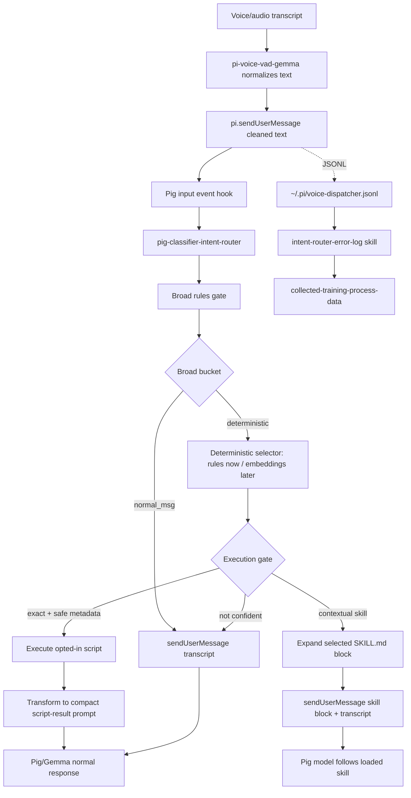

# Pig Classifier Intent Router Flow



Related deterministic harvest skill:

```text
/home/bot/.pig/agent/skills/intent-router-error-log
```

That skill should only run its script and report printed paths/counts.
